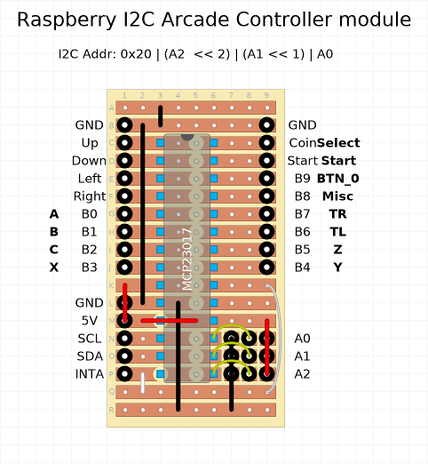
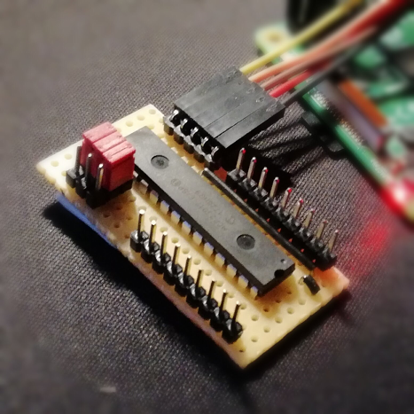
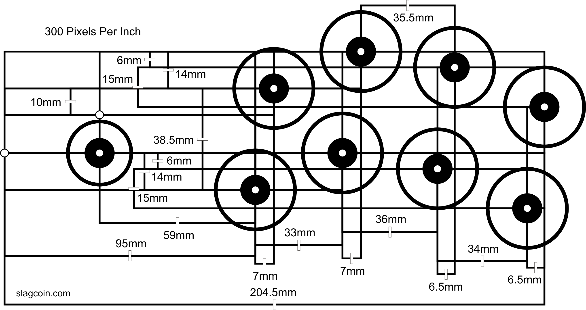
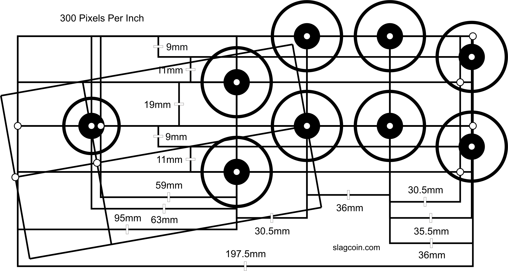

# Arcade controller board

This project consist of schematics and a linux kernel driver module
for a controller board used for building an Arcade machine. The board
is easily build on a strip-board with minimal components and costs.

The requirement for using the _arcade controller board_ is that you
have an hardware platform with 5V, I2C bus to chain your board on and
a gpio pin available for each board you hook up, used for interrupt
driven input. With other words, a normal computer is not working and
you need to look into hardware of the Raspberry Pi era that meets
specified hardware requirements.

Three boards are needed for a two player setup cabinet and two boards
for a single player configuration. The design of the _arcade
controller board_ allows a maximum of 7 boards to be connected to the
I2C bus. This means a maximum of 112 individual inputs and allows for
any imaginable cabinet build as long that you have 7 gpio pins
available for allocation.

Conceptually, there are two types of controller boards _player_ and
_auxiliary_. You need at least one player and one _auxiliary_
controller for a single player setup, you can skip the _auxiliary_ but
how fun is that. The actual hardware used for the two types of
controller boards does not differ, they are both design the same way
and specifying a type is just a matter of a software configuration.

The differences are that the _player_ controller board will provide 16
individual inputs for the player this is more than enough for game
play of most arcade and consoles. The _auxiliary_ controller board
will provide additional 8 individual inputs used for generic input for
example special emulator commands etc. and 8 generic outputs which you
can use for steering hardware in your cabinet build.

This project provides an Linux kernel module with the driver for the
two types of boards and some parameters to define which board is of
what type. The type mapping is done by the configurable I2C address
using jumpers on the _arcade controller board_.

When you load the Linux kernel driver module, it will try to
instantiate three instances of the driver, two _player_ and one
_auxiliary_ instance. Each instance creates and evdev input device for
use with the Linux input system that is then mapped and used by the
emulator of your choice.

The special _auxiliary_ board will also create and evdev input device
with eight buttons. The 8 outputs of an _auxiliary_ board is exported
into sysfs to be controlled from software or scripts. Use it as you
see fits, for example turn on / off marque lights or what not.

## Building the board

_Arcade controller board_ is built around MCP23017 I2C I/O expander
chip and is very simple to build on a strip board.

Each board is connected to a I2C bus and a gpio pin used for interrupt
when any input changes. You will use jumpers to set the I2C address of
the board which is used by the Linux kernel driver to detect which
type of board to instantiate. You can provide module parameters when
loading the Linux kernel module driver to specify which address and
gpio pin to use for each board types. Read section
[Using the Linux kernel module](#using-the-linux-kernel-module) for
more details how to use the module.

The image below shows how to build one using strip board, it is also
marked up of which I/O pin that is mapped to input device event by the
driver for reference when hooking up the board with your hardware.

The result of a built _arcade controller board_ of above layout looks
like the following image. However you could with some ease actually
build three copies of the board into a hat design to sit on top of a
Raspberry Pi. Its a matter of taste really, however I will not provide
any hardware specific designs in this project.

As the built example above, you will see that this is very
minimalistic and clean build, anyone could do it.

### Hook up guide of Arcade joystic and buttons

Each input on the board should short with ground to generate an
event. A typical build is that you make an daisy chain of the the
ground through your switches and then hook up the individual gpio pin
with corresponding switch described in the strip-board schematics
above.

For my setup I choose the following standar layouts for the two player
controllers, first one is Player 1 setup, the left side of cabinet and
the second if for Player 2, right side. This is just for ideas and
reference, use any layout that fits your needs.

### Hook up with Raspberry Pi 3

My initial choice of emulation platform is the Raspberry Pi 3 and
therefor I will also describe how to hook up the boards with this
specific device.

Here follows a diagram for the pin header of Raspberry Pi 3. The pins
labled SDA1 / SCL1 is used for the I2C bus, and all your _arcade
controller boards_ should be connected in parallel on those two pins,
5v and ground. Each board will also allocate a individual gpio pin
used for interrupts which is also labled in diagram below.

Here follows the pin header layout for Raspberry Pi 3 and the pins you
will hook up the board to:

	       .---.
	       |[]o| 5v
	  SDA1 |o o| 5v
	  SCL1 |o o| Ground
	       |o o|
	       |o o|
	GPIO17 |o o|
	GPIO27 |o o|
	GPIO22 |o o|
	       .   .

	       .   .

Default settings for the Linux kernel driver is targeted the Raspberry
Pi 3 and if your configure your boards and hook as described below, it
will work just right out of the box.

- Player 1, I2C Address: 0x20, Interrupt: GPIO17
- Player 2, I2C Address: 0x21, Interrupt: GPIO27
- Auxiliary, I2C Address: 0x22, Interrupt: GPIO22

If you want to use other addresses or gpio pins, you can change this
using module parameters. This is needed for other hardware platforms
that is not Raspberry Pi 3 compatilble. Read more about how to do this
in section
[Using the Linux kernel module](#using-the-linux-kernel-module).

## Using the Linux kernel module

The driver is loaded using insmod or adding the module for automatic
load upon startup, this is distribution specific and I will not go
into details.

	insmod src/acb.ko boards="player:0x20:17","player:0x21:27","auxiliary:0x22:22"

As you noticed the above command describes each board with type and
which I2C addresses and gpio pin numbers to be used. Those values
above is the default and can be left out if you are using Raspberry Pi
and hooking up the boards as described in section
[Hook up with Raspberry Pi 3](#hook-up-with-raspberry-pi-3).

### Building the driver

To build the Linux kernel module driver you need to install the kernel
source package for your distribution, then just build the module using:

	make

This will build the kernel module `src/acb.ko` for your current
kernel. If you upgrade the kernel the module might need to be rebuilt
to work as expected, this is identified by error messages in dmesg log
while loading the module.

## Configuration of emulators

### Retroarch

Retroarch uses controller specific configuration files. These files
maps input events to retroarch buttons and exists in
`/usr/share/retroarch/autoconfig/udev/`. You need to create two
configuration files one for _player_ and one for _auxiliary_ and here
follows the examples configuration files.

/usr/share/retroarch/autoconfig/udev/acb_player.cfg

	input_device = "Arcade player controller"
	input_driver = "udev"

	input_b_btn = "1"
	input_y_btn = "3"
	input_select_btn = "6"
	input_start_btn = "7"
	input_up_axis = "-1"
	input_down_axis = "+1"
	input_left_axis = "-0"
	input_right_axis = "+0"
	input_a_btn = "0"
	input_x_btn = "2"
	input_l_btn = "4"
	input_r_btn = "5"

/usr/share/retroarch/autoconfig/udev/acb_auxiliary.cfg

	input_device = "Arcade auxiliary controller"
	input_driver = "udev"

	input_save_state_btn = "0"
	input_load_state_btn = "1"
	input_exit_emulator_btn = "2"
	input_reset_btn = "3"
	input_menu_toggle_btn = "4"
	input_enable_hotkey_btn = "5"
	input_pause_toggle = "6"

## Troubleshooting

### Connectivity

1. Verify that expected boards are instantiated correctly using the
   tool `evtest`, which shows a list of registered input devices one
   for each board. Verify that the list contains expected input
   controllers, names to look for are `Arcade player controller` and
   `Arcade auxiliary controller`. Then select one of them and test the
   controller inputs.

		evtest

2. If controller shows up in step 1, and nothing happens when testing
   the controllers, verify that you are using the correct gpio pin for
   input interrupt.

3. There are some minor logging when the Linux kernel module is
   loaded. Check the that there are no errors while loading the module
   using dmesg.

4. Probe the I2C bus for available devices and verify that your boards
   are found using the following tool. If no devices are found, probe
   other buses to find the correct one on you system:

		i2cdetect -y 1

